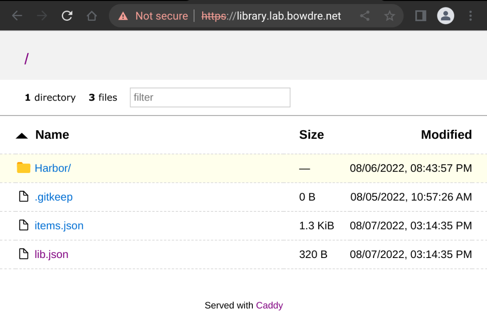
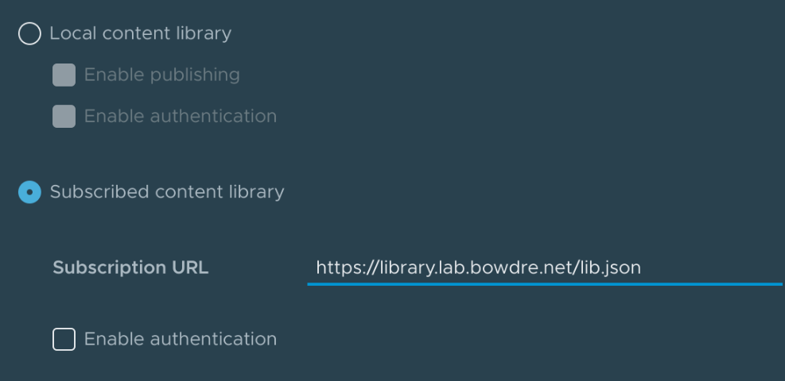
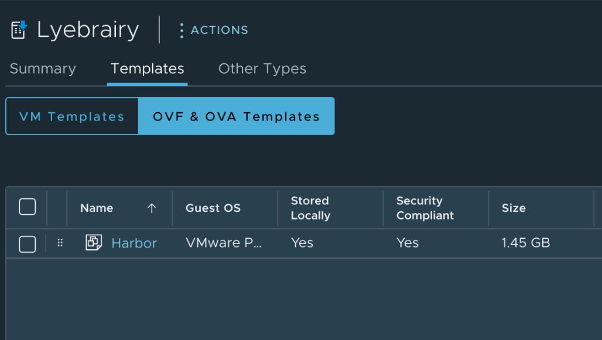

# library-syncer

This project aims to ease some of the pains encountered when attempting to sync VM templates in a [VMware vSphere Content Library](https://docs.vmware.com/en/VMware-vSphere/7.0/com.vmware.vsphere.vm_admin.doc/GUID-254B2CE8-20A8-43F0-90E8-3F6776C2C896.html) to a large number of geographically-remote sites under less-than-ideal networking conditions. 

## Overview
The solution leverages lightweight Docker containers in server and client roles. The servers would be deployed at the primary datacenter(s), and the clients at the remote sites. The servers make a specified library folder available for the clients to periodically synchronize using `rsync` over SSH, which allows for delta syncs so that bandwidth isn't wasted transferring large VMDK files when only small portions have changed. 

Once the sync has completed, each client runs a [Python script](client/build/update_library_manifests.py) to generate/update a Content Library JSON manifest which is then published over HTTP/HTTPS (courtesy of [Caddy](https://caddyserver.com/)). Traditional Content Libraries at the local site can connect to this as a [subscribed library](https://docs.vmware.com/en/VMware-vSphere/7.0/com.vmware.vsphere.vm_admin.doc/GUID-9DE2BD8F-E499-4F1E-956B-67212DE593C6.html) to make the synced items available within vSphere.

After the initial, immediate sync, subsequent syncs are initiated through a `cron` scheduled task.

The rough architecture looks something like this:
```
                        |
     PRIMARY SITE       |      REMOTE SITES      +----------------------------+
                        |                        |          vSphere           |
                        |    +----------------+  |   +--------------------+   |
                        |    |                |  |   |                    |   |
                        |    | library-syncer |  |   | subscribed content |   |
                     +--+--->|                +--+-->|                    |   |
                     |  |    |    client      |  |   |      library       |   |
                     |  |    |                |  |   |                    |   |
                     |  |    +----------------+  |   +--------------------+   |
                     |  |                        |                            |
+-----------------+  |  |    +----------------+  |   +--------------------+   |
|                 |  |  |    |                |  |   |                    |   |
|  library-syncer |  |  |    | library-syncer |  |   | subscribed content |   |
|                 +--+--+--->|                +--+-->|                    |   |
|     server      |  |  |    |    client      |  |   |      library       |   |
|                 |  |  |    |                |  |   |                    |   |
+-----------------+  |  |    +----------------+  |   +--------------------+   |
                     |  |                        |                            |
                     |  |    +----------------+  |   +--------------------+   |
                     |  |    |                |  |   |                    |   |
                     |  |    | library-syncer |  |   | subscribed content |   |
                     +--+--->|                +--+-->|                    |   |
                        |    |    client      |  |   |      library       |   |
                        |    |                |  |   |                    |   |
                        |    +----------------+  |   +--------------------+   |
                        |                        +----------------------------+
```

## Prerequisites
### Docker and `docker-compose`
You'll need Docker (and preferably also `docker-compose`) on both the server and client VMs. Installing and configuring Docker is beyond the scope of this document as it will largely depend on what operating system you settle on for the Docker hosts. 

### SSH keypair for `rsync` user
The server image includes a `syncer` user account which the clients will use to authenticate over SSH. This account is locked down and restricted with `rrsync` to only be able to run `rsync` commands. All that you need to do is generate a keypair for the account to use:

```shell
ssh-keygen  -t rsa -b 4096 -N "" -f id_syncer
```

### TLS certificate pair (optional)
By default, the client will publish its library over HTTP. If you set the `TLS_NAME` environment variable to the server's publicly-accessible FQDN, the Caddy web server will [automatically retrieve and apply a certificate issued by Let's Encrypt](https://caddyserver.com/docs/automatic-https). For deployments on internal networks which need to use a certificate issued by an internal CA, you can set `TLS_CUSTOM_CERT=true` and add the private key and certificate to the clients - more on that in a minute.

You can generate the cert signing request and key in one shot like this:
```shell
openssl req -new \
-newkey rsa:4096 -nodes -keyout library.example.com.key \
-out library.example.com.csr \
-subj "/C=US/ST=Somestate/L=Somecity/O=Example.com/OU=LAB/CN=library.example.com"
```

## Usage
### Server
#### Preparation
VM templates should be stored on the Docker host in its own folder under the `./data/library/` path. These should be in OVF format, _not_ OVA format, so that they can be made available in the vSphere inventory on the remote side. 

(For extra credit, you can export the `./data/library/` path as an NFS share and mount that as a datastore in vSphere. This would make it an easy target for a CI/CD pipeline to crank out new/updated templates on a regular schedule, and those would then be automatically available to the `library-syncer` clients without any additional effort. *Just a thought.*)

The server also needs the `id_syncer.pub` public key which was [generated earlier](#ssh-keypair-for-rsync-user). Place it in the `./data/ssh/` folder.

Example folder structure:
```
.
├── data
│   ├── library
|   |   ├── Template_1
|   |   |   ├── template_1.ovf
|   |   |   └── template_1.vmdk 
|   |   ├── Template_2
|   |   |   ├── template_2.ovf
|   |   |   └── template_2.vmdk 
│   └── ssh
│       └── id_syncer.pub
└── docker-compose.yaml
```

#### Configuration
Strangely enough, the server side is a lot easier to configure than the client. The container just needs two volumes (one to hold the SSH key, and the other to hold the library content), and one network port on which to listen for incoming `rsync`-over-SSH connections from the clients. 

You can change the port mapping if you'd like, just as long as it's not a port which will be used by the Docker host itself so that incoming connections can be tunneled into the container.

Here's an example `docker-compose.yaml` for the server:
```yaml
version: '3'
services:
  library-syncer-server:
    container_name: library-syncer-server
    restart: unless-stopped
    image: ghcr.io/jbowdre/library-syncer-server:latest
    environment:
      - TZ=UTC
    ports:
      - "2222:22"
    volumes:
      - './data/ssh:/home/syncer/.ssh'
      - './data/library:/syncer/library'
```

#### Execution
Once everything is in place, start the server:
```shell
; docker-compose up -d
Creating network "server_default" with the default driver
Pulling library-syncer-server (ghcr.io/jbowdre/library-syncer-server:latest)...
latest: Pulling from jbowdre/library-syncer-server
Digest: sha256:a149c7960693db8e8666330283f92948a81e692eefcbf950c4d72ace946b325c
Status: Downloaded newer image for ghcr.io/jbowdre/library-syncer-server:latest
Creating library-syncer-server ... done
```

After a few moments, verify that it is running successfully:
```shell
; docker ps
CONTAINER ID   IMAGE                                          COMMAND                  CREATED          STATUS          PORTS                                   NAMES
89d14424a1b9   ghcr.io/jbowdre/library-syncer-server:latest   "/entrypoint.sh /usr…"   53 seconds ago   Up 52 seconds   0.0.0.0:2222->22/tcp, :::2222->22/tcp   library-syncer-server
```

### Client
#### Preparation
Like the server, the client also needs a `./data/library` directory to store the synced templates, but this should be empty to start with.

Be sure to drop the `id_syncer` private key you [generated earlier](#ssh-keypair-for-rsync-user) in `./data/ssh`.

If you need to use a [custom TLS certificate](#tls-certificate-pair-optional), place the PEM-formated `cert.pem` and `key.pem` in `./data/certs`.

Example folder structure:
```
.
├── data
│   ├── certs
│   │   ├── cert.pem
│   │   └── key.pem
│   ├── library
│   └── ssh
│       └── id_syncer
└── docker-compose.yaml
```

#### Configuration
Some decisions need to be made on the client side, and most of those will be expressed in the form of environment variables passed into the container:

| Variable | Example value (default)| Description |
|:--- |:--- |:--- |
| `SYNC_PEER` | `deb01.lab.bowdre.net` | FQDN or IP of the `library-syncer` server to which the client will connect |
| `SYNC_PORT` | (`2222`)| SSH port for connecting to the server |
| `SYNC_SCHEDULE` | (`0 21 * * 5`) | `cron`-formatted schedule for when the client should initiate a sync (example syncs at 9PM on Friday night) |
| `SYNC_DELAY` | `true` (`false`) | if true, sleeps a random number of seconds before begining the sync |
| `SYNC_DELAY_MAX_SECONDS` | (`21600`) | maximum seconds to sleep (example will be delayed up to 6 hours) |
| `SYNC_MAX_BW` | `1.5m` (`0`) | `rsync` bandwidth limit; `1.5m` caps at 1.5MB/s, `0` is unlimited | 
| `TLS_NAME` | `library.bowdre.net` | if set, the FQDN used for the client's web server; if not set, the library will be served strictly over HTTP |
| `TLS_CUSTOM_CERT` | `true` (`false`) | if `true`, the web server will expect to find a custom certificate *and private key* in the `./data/certs` volume |
| `LIBRARY_NAME` | (`Library`) | this name will show up in the generated Content Library JSON, but not anywhere else |
| `LIBRARY_BROWSE` | `true` (`false`) | enable directory browsing on the web server; otherwise you'll need to know the exact path of the item you're after |

Introducing a random sync delay might be useful if you have a bunch of remote sites and don't want them to attempt to sync all at once, but you're too lazy to manually customize the schedule for each one of them (no judgment!).

If you specify a `TLS_NAME` but don't set `TLS_CUSTOM_CERT`, the Caddy web server will automatically request and install a Let's Encrypt certificate for your specified FQDN. For this to work, the name must resolve in public DNS, and any firewalls must permit inbound traffic on port 80. Otherwise, the ACME validation will fail and you'll need to go back and try the `TLS_CUSTOM_CERT` route instead. 

Here's a sample `docker-compose.yaml` for the client:
```yaml
version: '3'
services:
  library-syncer-client:
    container_name: library-syncer-client
    restart: unless-stopped
    image: ghcr.io/jbowdre/library-syncer-client:latest
    environment:
      - TZ=UTC
      - SYNC_PEER=deb01.lab.bowdre.net
      - SYNC_PORT=2222
      - SYNC_SCHEDULE=0 21 * * 5
      - SYNC_DELAY=true
      - SYNC_DELAY_MAX_SECONDS=21600
      - SYNC_MAX_KBPS=0
      - TLS_NAME=library.lab.bowdre.net
      - TLS_CUSTOM_CERT=true
      - LIBRARY_NAME=Library
      - LIBRARY_BROWSE=true
    ports:
      - "80:80/tcp"
      - "443:443/tcp"
    volumes:
      - './data/ssh:/syncer/.ssh'
      - './data/library:/syncer/library'
      - './data/certs:/etc/caddycerts'
```

#### Execution
As before, just bring it up:
```shell
; docker-compose up -d
Creating network "client_default" with the default driver
Pulling library-syncer-client (ghcr.io/jbowdre/library-syncer-client:latest)...
latest: Pulling from jbowdre/library-syncer-client
530afca65e2e: Already exists
edb0ffa072a9: Already exists
18ca3da84db3: Already exists
590e61dd146f: Already exists
ada635729e38: Already exists
a141ea18b199: Pull complete
4f86c976127e: Pull complete
14769d09851e: Pull complete
Digest: sha256:75415d182d4e3c1534a1668574ddc2eaf2d1d9d946ec3075972517ee9b19a1b9
Status: Downloaded newer image for ghcr.io/jbowdre/library-syncer-client:latest
Creating library-syncer-client ... done
```

```shell
; docker ps
CONTAINER ID   IMAGE                                          COMMAND                  CREATED          STATUS          PORTS                                                                      NAMES
e3175d1e1f30   ghcr.io/jbowdre/library-syncer-client:latest   "/entrypoint.sh sh -…"   34 seconds ago   Up 34 seconds   0.0.0.0:80->80/tcp, :::80->80/tcp, 0.0.0.0:443->443/tcp, :::443->443/tcp   library-syncer-client
```

Watch the logs to see how it's going:
```shell
; docker logs library-syncer-client
[2022/08/07-02:53:23] Performing initial sync...
[2022/08/07-02:53:23] Sync sync starts NOW!
Warning: Permanently added '[deb01.lab.bowdre.net]:2222' (RSA) to the list of known hosts.
receiving incremental file list
./
Harbor/
Harbor/Harbor-disk1.vmdk
Harbor/Harbor.mf
Harbor/Harbor.ovf

sent 104 bytes  received 940,320,236 bytes  144,664,667.69 bytes/sec
total size is 940,090,405  speedup is 1.00
[2022/08/07-02:53:29] Generating content library manifest...
[2022/08/07-02:53:32] Sync tasks complete!
[2022/08/07-02:53:32] Creating cron job...
[2022/08/07-02:53:32] Starting caddy...
{"level":"info","ts":1659840812.1830192,"msg":"using provided configuration","config_file":"/etc/caddy/Caddyfile","config_adapter":""}
{"level":"warn","ts":1659840812.1841364,"msg":"Caddyfile input is not formatted; run the 'caddy fmt' command to fix inconsistencies","adapter":"caddyfile","file":"/etc/caddy/Caddyfile","line":2}
{"level":"info","ts":1659840812.1854694,"logger":"admin","msg":"admin endpoint started","address":"tcp/localhost:2019","enforce_origin":false,"origins":["//localhost:2019","//[::1]:2019","//127.0.0.1:2019"]}
{"level":"info","ts":1659840812.1858737,"logger":"tls.cache.maintenance","msg":"started background certificate maintenance","cache":"0xc000502070"}
{"level":"warn","ts":1659840812.186252,"logger":"tls","msg":"stapling OCSP","error":"no OCSP stapling for [library.lab.bowdre.net]: no OCSP server specified in certificate"}
{"level":"info","ts":1659840812.1863828,"logger":"http","msg":"skipping automatic certificate management because one or more matching certificates are already loaded","domain":"library.lab.bowdre.net","server_name":"srv0"}
{"level":"info","ts":1659840812.1863937,"logger":"http","msg":"enabling automatic HTTP->HTTPS redirects","server_name":"srv0"}
{"level":"info","ts":1659840812.1868215,"logger":"tls","msg":"cleaning storage unit","description":"FileStorage:/root/.local/share/caddy"}
{"level":"info","ts":1659840812.1868465,"logger":"tls","msg":"finished cleaning storage units"}
{"level":"info","ts":1659840812.187277,"msg":"autosaved config (load with --resume flag)","file":"/root/.config/caddy/autosave.json"}
{"level":"info","ts":1659840812.1872904,"msg":"serving initial configuration"}
Successfully started Caddy (pid=26) - Caddy is running in the background
[2022/08/07-02:53:32] Starting cron...
```

The startup tasks are complete once you see the messaging about starting `cron`. If you'd like, you can verify the sync schedule was created successfully:
```shell
; docker exec library-syncer-client crontab -l
[...]
0 21 * * 5 /syncer/sync.sh delay > /proc/self/fd/1 2>/proc/self/fd/2
```

Open a web browser to `http://$DOCKER_HOST_IP/lib.json`/`https://$TLS_NAME/lib.json` and you can see the top-level library item:
```json
{
  "vcspVersion": "2",
  "version": "1",
  "contentVersion": "1",
  "name": "Library",
  "id": "urn:uuid:aa465152-4ed2-44f5-8fb0-4fac5e03016a",
  "created": "2022-08-07T20:14Z",
  "capabilities": {
    "transferIn": [
      "httpGet"
    ],
    "transferOut": [
      "httpGet"
    ]
  },
  "itemsHref": "items.json"
}
```

Or hit the site root if `LIBRARY_BROWSE` is enabled:


### Subscribed library
The final piece of this puzzle to create a content library inside of vSphere to subscribe to the `library-syncer-client` library. This will (finally) make those templates available to deploy directly in vSphere.

1. Log into the vSphere Client and navigate to **Menu > Content Libraries**.
2. Click **Create**, give your new library a good name, and click **Next**.
3. Click the button to make this a **Subscribed Content Library**, and enter the URL of the `library-syncer-client` library. The URL should end with `/lib.json`. 

4. Select the option to download content immediately. At this point, content will just be transferred within a local site so bandwidth shouldn't be a concern. Click **Next**.
5. From this point, it's creating a library as usual. Click **Next** again unless you want to set a specific security policy, then select the datastore where the vSphere copy of the templates should be stored, then finally hit **Finish** to complete.

You can then view the new library in vSphere and see that the template(s) have synced successfully:


Success!
